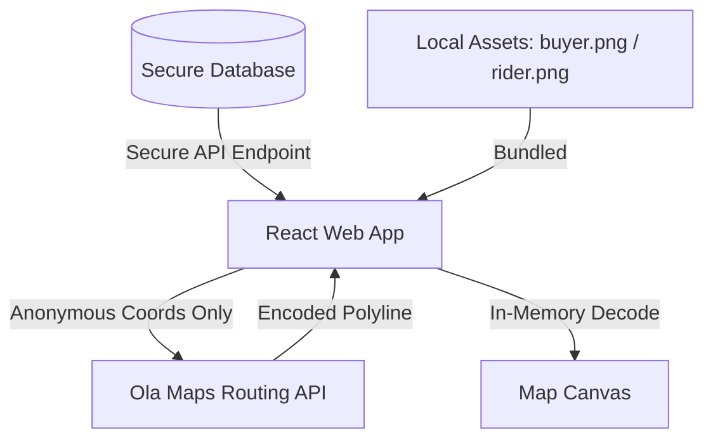

# GoRola DPDP Compliance — Geolocation & Map Privacy

This document outlines the design and code-level mechanisms implemented in GoRola to align our geolocation features and map rendering with India's **Digital Personal Data Protection Act, 2023 (DPDP Act)**.

Under the DPDP Act, geolocation coordinates represent personal data. Processing, rendering, and routing coordinates requires strict adherence to data minimization, purpose limitation, and strong security safeguards.

---

## 1. Core Principles of DPDP Alignment in Mapping

GoRola's maps (for buyers, store partners, and riders) are designed around the principle of **Data Minimization** and **Data Decoupling**. We ensure that user coordinates are never unnecessarily leaked, logged by third parties, or used for cross-site tracking.

---

## 2. Technical Implementation Details

### A. Client-Side Decoupled Coordinates
User and rider coordinates are fetched securely from our own backend database (using tables like `Order` and `RiderLocation` with fields `deliveryLat`, `deliveryLng`, `lat`, and `lng`).
- **No Third-Party Intermediary Logs:** The location updates are pushed directly to our backend via authenticated REST calls and Socket.IO namespaces (`/rider`).
- **Access Scoping:** Only authorized clients (the rider assigned to the order and the buyer who placed the order) can query the location. This is strictly enforced by token-based authentication and role guards.

### B. Local Asset Loading & IP Masking
Many map widgets fetch marker pin assets (like default icons) from external public CDNs, which allows those CDNs to collect user IP addresses, cookies, and browsing context.
- **Compiled Assets:** GoRola imports custom markers (`buyer.png` and `rider.png`) directly from `src/assets`.
- Vite compiles and bundles these assets locally so they are served directly from GoRola's web server.
- No external CDN calls are made to load map symbols.

### C. In-Memory Routing & Anonymous Payloads
When drawing road routes on the map (using the Leaflet or Ola Maps adapters), we call the Ola Maps Directions API.
- **Data Minimization:** We only transmit the raw start coordinate and end coordinate to the routing API.
- **No User Profiling:** We never send user identifiers, names, phone numbers, or exact address strings (like street or landmarks) to the routing API.
- **In-Memory Processing:** The route response (returned as an encoded polyline string) is decoded completely in client-side memory using the helper method `decodePolyline` in `map-route-helper.ts`. No permanent trace or logs of the decoded road path are sent to external logs.

### D. Straight-Line Mathematical Fallback
If the routing API fails, is rate-limited, or has expired keys:
- The system immediately stops making API calls to avoid continuous telemetry leaks.
- The map adapter falls back to calculating a straight line or bezier curve between the two coordinates locally in the client browser.
- This keeps the interface functional without continuously querying third-party APIs with coordinate logs.
