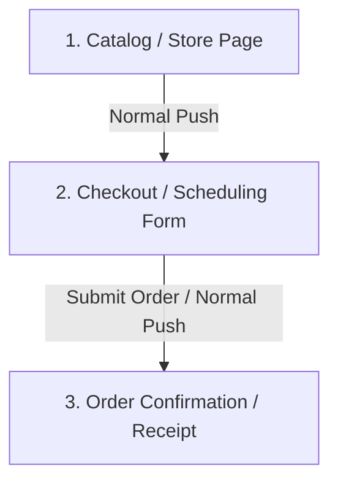
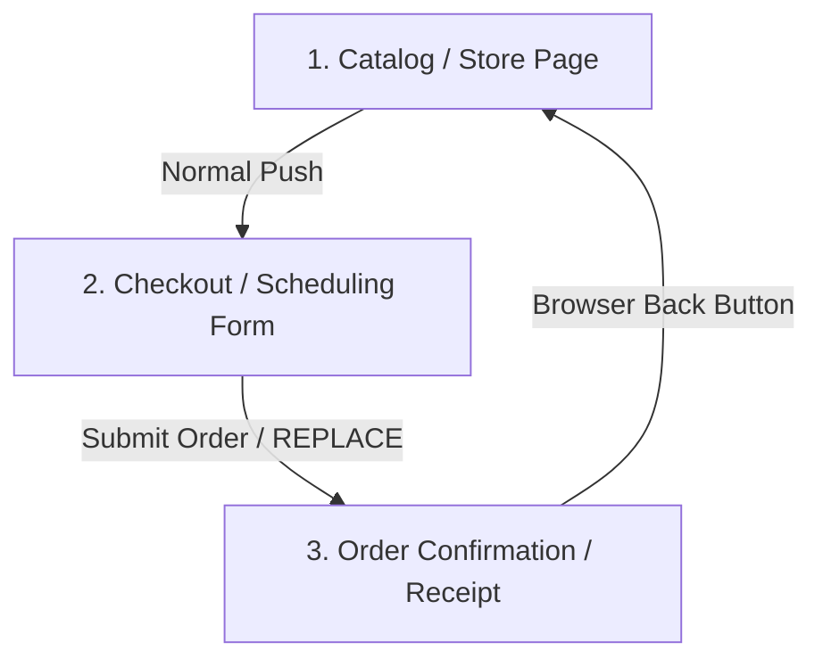

# SPA History Stack Replacement: The Checkout Back-Button Trap

This guide explains the architectural rationale and implementation strategy for preventing duplicate submissions, broken cart states, and bad UX when a user presses the browser's "Back" button on order confirmation or checkout receipt pages.

---

## 1. The Problem: The Duplicate Transaction Loop

In standard web applications, every navigation action pushes a new page onto the browser's history stack. 

### **The Default Navigation Flow:**


### **The Vulnerability:**
When the user is looking at the **Receipt Page (3)** and presses their browser's **Back** button:
1. The browser pops the Receipt Page off the stack and takes the user back to the **Checkout / Scheduling Form (2)**.
2. The user sees the form they just submitted.
3. If they click the "Submit" or "Place Order" button again (perhaps thinking the first order didn't go through), they create a **duplicate order**.
4. This leads to duplicate credit card charges, incorrect stock inventory decrements, and major support overhead.

---

## 2. The Solution: History Stack Replacement (`replace: true`)

Instead of pushing the confirmation page on top of the history stack, we **replace** the current checkout page entry with the confirmation page entry.

### **The Optimized Navigation Flow:**


By using the **Replace** transition:
1. The Checkout Page card is **thrown away** from the history stack.
2. The Receipt Page is slotted directly on top of the Store Page.
3. When the user clicks the browser's **Back** button on the Receipt Page, the browser skips the checkout form entirely and takes them directly back to the **Catalog / Store Page (1)**.
4. Since the cart/scheduling state is already wiped upon successful checkout, returning to the catalog is natural, safe, and prevents any possibility of resubmission.

---

## 3. How to Implement Across Frameworks

This pattern is a universal feature in modern Single Page Application (SPA) routers.

### **React Router v6 (Vite / CRA)**
Use the `{ replace: true }` option inside `navigate()`:
```typescript
const navigate = useNavigate();

const handlePlaceOrder = async () => {
  const orderId = await placeOrderApi();
  // Clear cart state first
  clearCart();
  
  // Navigate and overwrite the active history entry
  navigate(`/orders/${orderId}`, { replace: true });
};
```

### **Next.js (App Router)**
Use `router.replace()` instead of `router.push()`:
```typescript
import { useRouter } from 'next/navigation';

const router = useRouter();

const handlePlaceOrder = async () => {
  const orderId = await placeOrderApi();
  clearCart();
  
  router.replace(`/orders/${orderId}`);
};
```

### **SvelteKit / Sapper**
Pass the `replaceState` option inside `goto()`:
```typescript
import { goto } from '$app/navigation';

const handlePlaceOrder = async () => {
  const orderId = await placeOrderApi();
  clearCart();
  
  goto(`/orders/${orderId}`, { replaceState: true });
};
```

---

## 4. GoRola Implementation Example

In the GoRola codebase, this is handled in two critical boundary files:

### **1. Quick Commerce Checkout (`apps/web/src/pages/buyer/CheckoutPage.tsx`)**
Inside the TanStack `useMutation` success handler:
```typescript
const placeMutation = useMutation({
  mutationFn: async () => {
    // API order placement logic...
  },
  onSuccess: (orderId) => {
    clearCart();
    
    // Replace the /checkout history entry
    navigate(`/orders/${orderId}`, { replace: true });
  }
});
```

### **2. Booking Commerce Scheduling (`apps/web/src/pages/buyer/BookingTimeslotPage.tsx`)**
Inside the scheduled appointment success callback:
```typescript
const handleSchedule = async () => {
  const res = await api.post('/api/v1/bookings', body);
  
  // Replace the /bookings/new history entry
  navigate(`/bookings/${res.data.data.orderId}`, { replace: true });
};
```

---

## 5. Summary Checklist for Future Projects

- [ ] **Never** use a standard router push (`navigate` or `router.push`) when redirecting from a form view to a transaction confirmation receipt.
- [ ] **Always** wipe checkout/cart state *before* triggering the history replace redirect.
- [ ] **Always** provide a clear, positive on-screen action button on the confirmation page (e.g., `"Track Order in History"`) to guide the user's forward attention.
- [ ] **Verify** via manual testing: Fill out a form, submit it, wait for confirmation, click the browser's native Back button, and ensure you are routed back to the storefront instead of the form.
