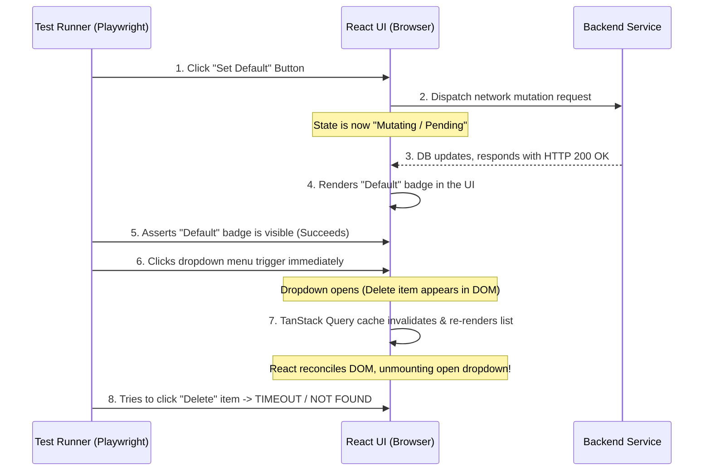

# Guide: Structurally Eliminating E2E Flakiness & State-Render Race Conditions

E2E (End-to-End) test suites frequently pass 100% of the time on local machines, only to display flaky failures or intermittent timeout errors in CI/CD pipelines (e.g., GitHub Actions, GitLab CI, Vercel Previews). 

This guide outlines the root causes, detection techniques, and production-grade engineering patterns to structurally eliminate these timing race conditions.

---

## 1. The Core Paradox: Local vs. CI Environments

To solve E2E flakiness, you must understand the hardware disparity:
* **Local Machines:** Have high CPU speeds, multiple physical cores, and zero resource contention. React state updates and database queries complete near-instantaneously, hiding asynchronous race conditions.
* **CI/CD Runners:** Run on highly constrained, shared virtual machines (often 2 vCPUs). CPU throttling and memory allocation limits are common. This delays React rendering ticks and API network roundtrips by orders of magnitude, exposing micro-timing vulnerabilities.

---

## 2. The Classic "React State Re-Render" Race Condition

This is the most common form of UI flakiness. It occurs when **Playwright/Cypress is faster than the browser's React state machine.**

### Chronology of a Failure


### Why it manifests as "Flaky"
Because of system CPU latency variations, sometimes Step 7 completes *before* Step 6, and sometimes it completes *after* Step 6. If it completes during/after Step 6, the re-render tears down the newly opened dropdown, failing the test. Playwright retries the test, the timing window shifts, and it passes on the retry (marking it **flaky** instead of **red**).

---

## 3. Structural Solution Patterns

Do not use raw time delays (e.g., `page.waitForTimeout(1000)` or `setTimeout`). These are anti-patterns that bloat E2E run times and eventually fail when CI becomes even slower. Instead, use **reactive synchronization gates**.

### Pattern A: Network In-Flight Settlement Gates (Recommended)
Force the test runner to wait for the background network mutation and subsequent data refreshes to complete **before** executing subsequent UI interactions.

```typescript
// 1. Set up the network hook FIRST
const refreshPromise = page.waitForResponse(async (resp) => {
  return resp.url().includes('/api/v1/addresses') && resp.request().method() === 'GET';
}, { timeout: 15000 });

// 2. Perform the action
await defaultItem.click();

// 3. Wait for the network call to fully settle
await refreshPromise;

// 4. Proceed to click interactive menus safely
await menuBtn.click();
```

### Pattern B: UI Landmark Settlement Gates
If you cannot hook the network request, assert a visual "landmark" that proves the parent container has finished updating and is stable.

* **Wait for a skeleton/loading state to disappear:**
  ```typescript
  await expect(page.locator('.loading-skeleton')).not.toBeVisible({ timeout: 10000 });
  ```
* **Wait for transition attributes to finish:**
  Check if a container has settled into its final class or state (e.g. `aria-busy="false"` or `data-state="idle"`).

### Pattern C: Decoupling Dropdowns from Re-renders
For maximum structural safety in your component design:
* Use **inline actions** (like direct icons/buttons for delete/edit) instead of hiding high-frequency actions inside nested hover or popup menus (`DropdownMenu`), especially for lists that undergo reactive query updates.

---

## 4. Case Study: GoRola Address CRUD Flakiness

### The Vulnerable Test Code (`checkout.spec.ts`)
```typescript
// Triggering the change
await defaultItem.click();
await expect(addressCard.locator('[data-testid="default-badge"]')).toBeVisible();

// DELETE PHASE (RACY)
await menuBtn.click(); // Opens dropdown
const deleteItem = page.getByRole('menuitem', { name: /Delete/i });
await expect(deleteItem).toBeVisible({ timeout: 10000 }); // <-- FAILS HERE (Menu unmounted by default-mutation's re-render)
await deleteItem.click();
```

### The Stabilized Test Code
To fix this, we ensure that we wait for the update mutation's API fetch and the subsequent cache refresh to finish completely before opening the dropdown.

```typescript
// 1. Hook the GET address network response representing the post-update refresh
const refreshPromise = page.waitForResponse(async (resp) => {
  if (resp.url().includes('/api/v1/addresses') && resp.request().method() === 'GET') {
    const json = await resp.json().catch(() => ({}));
    // Check that our modified address card is returned with its default state true
    return json.data?.addresses?.some((a: any) => a.label === uniqueLabel && a.isDefault === true);
  }
  return false;
}, { timeout: 15000 });

// 2. Click "Set as Default"
await defaultItem.click();

// 3. Wait for database and UI state synchronization to settle 100%
await refreshPromise;
await expect(addressCard.locator('[data-testid="default-badge"]')).toBeVisible();

// 4. It is now completely safe to click menus and trigger delete
await menuBtn.click();
const deleteItem = page.getByRole('menuitem', { name: /Delete/i });
await expect(deleteItem).toBeVisible({ timeout: 10000 });
await deleteItem.click();
```

---

## 5. The Double-Click Event Race: GSAP Animations vs. Radix UI Focus Lifecycle

In modern premium websites, animations (like GSAP timelines) and interactive overlays (like Radix UI Dropdowns, Modals, and Drawers) are ubiquitous. In E2E testing, these present two highly deceptive timing races that can easily fail your pipeline.

### A. The GSAP / CSS Animation Trap
* **The Concept:** GSAP and CSS animations animate elements smoothly over time. In E2E tests, clicking an element while it is sliding or fading in/out can cause the click coordinates to miss or target a half-rendered state.
* **The Native Solution:** We often bypass this by globally disabling GSAP or setting transition durations to `0` in E2E environments (e.g., `gsap.globalTimeline.clear()`, or CSS `* { transition: none !important; animation: none !important; }`).
* **The Gotcha:** While disabling the visual animation makes the element instantly appear/disappear, **it does NOT disable the underlying Javascript rendering ticks or component lifecycle delays**.

### B. The Radix UI Focus & Pointer-Event Overlay Race (Why clicks get lost)
Even with animations completely disabled, UI primitives (like Radix UI / Shadcn UI) have complex internal event-handling routines that run asynchronously:
1. **Focus Restoration (`FocusScope`):** When a dropdown menu, modal, or popover closes, Radix schedules a microtask to asynchronously return keyboard focus back to the button that triggered it (`menuBtn`).
2. **Pointer-Event Interceptor (`DismissableLayer`):** To prevent mouse clicks from firing on the background page while a dropdown is open, Radix mounts a full-screen transparent overlay with `pointer-events: auto`.
3. **The Race Condition:**
   - **Step 1:** You click a menu item (like "Set as Default").
   - **Step 2:** The dropdown closes. The portal is unmounted.
   - **Step 3:** Radix begins tearing down the `DismissableLayer` and restoring focus to `menuBtn` inside an asynchronous tick.
   - **Step 4:** Playwright immediately fires a click on `menuBtn` to reopen the menu for another action (like "Delete").
   - **Step 5:** Because the tear-down of the overlay and focus restoration takes a frame, the click event is **intercepted and swallowed** by the dying pointer-event overlay. The menu never opens, and the next expectation fails.

### C. The Bulletproof Pattern for Future Projects
Whenever you are performing consecutive interactions with the **same trigger element** (e.g. opening a menu, clicking an item, and then immediately opening the menu again to click another item):

1. **Assert complete unmounting of the overlay first:**
   ```typescript
   // Wait for the popup menu to be completely removed from the DOM/Viewport
   await expect(page.getByRole('menu')).not.toBeVisible();
   ```
2. **Add a brief event-binding cooldown buffer:**
   ```typescript
   // A tiny 300ms-500ms timeout guarantees the browser thread has finished Radix focus restoration
   await page.waitForTimeout(500);
   ```
3. **Confirm the overlay is open before querying its child items:**
   ```typescript
   await menuBtn.click();
   await expect(page.getByRole('menu')).toBeVisible(); // Confirms Radix has painted the new portal
   ```

---

## 6. Case Study: Timezone-Boundary Validation Fallbacks
### The Problem
When E2E tests select "tomorrow" (`+1 day`) for booking slots, timezone discrepancies between the local system running the browser and the backend server (especially near the midnight boundary) can cause the server to calculate the selection as "today". If the backend enforces a `1-day` minimum lead-time restriction, this results in an unexpected validation failure (`INVALID_BOOKING_DATE`).

### The Solution
Shift all E2E date selections to **at least 2 days in the future** (`+2 days`). This is completely compliant with lead-days constraints and mathematically immune to midnight-boundary or timezone-offset discrepancies between the browser context and backend environments.

---

## 6. Case Study: WebSocket Query Invalidation Settlement
### The Problem
When a real-time event (like a booking status change) is received via Socket.IO, updating the local React state immediately (e.g. `status = "CANCELLED"`) is highly responsive. However, doing so *without* updating secondary backend properties (like the `rejectionReason`) leaves the client in a partially sync-locked state, causing E2E tests to fail when verifying that the rejection reason is displayed alongside the status.

### The Solution
When a status changed socket event is received, perform a two-pronged sync action:
1. **Optimistic UI Update:** Immediately update the local query's status field to prevent visual lag or state flickering.
2. **Cache Invalidation:** Call `queryClient.invalidateQueries` for that specific query. This forces a clean, concurrent API refetch in the background, pulling down the fully updated database object (including `rejectionReason`) deterministically.

---

## 7. Summary Cheat Sheet for Developers

| Symptom | Probable Cause | Corrective Action |
| :--- | :--- | :--- |
| `Locator not found / Timeout` on modal, dropdown, or submenu | Component re-render unmounted the UI overlay mid-flight. | Wait for the cache update/query refresh to settle (`waitForResponse`) before opening the menu. |
| Test fails on CI but is 100% green locally | CI runner CPU throttle lag slows React/DOM rendering cycles. | Avoid arbitrary delays; use dynamic assertion gates (`toBeVisible`, `toHaveCount`). |
| Click event doesn't seem to fire | A layout shift or overlapping toast message intercepted the click. | Use `{ force: true }` or scroll the element into view first (`scrollIntoViewIfNeeded()`). |
| `INVALID_BOOKING_DATE` failure on midnight/timezone boundary | Server and browser date mismatch on `+1 day` boundaries. | Shift the E2E date selection to **at least +2 days** in the future to ensure safety. |
| Stale details (like rejection reason) missing after WebSocket status update | The socket event only pushed the basic status string without secondary DB fields. | Concurrently update local status query data optimistically, and trigger `queryClient.invalidateQueries` to fetch the complete updated record. |
| `locator.click: Timeout` on multi-viewport navigation links | The first matched element is hidden in the current viewport (e.g. desktop sidebar is hidden on mobile). | Use `.filter({ visible: true }).first()` to dynamically target the active visible element in the current viewport. |

