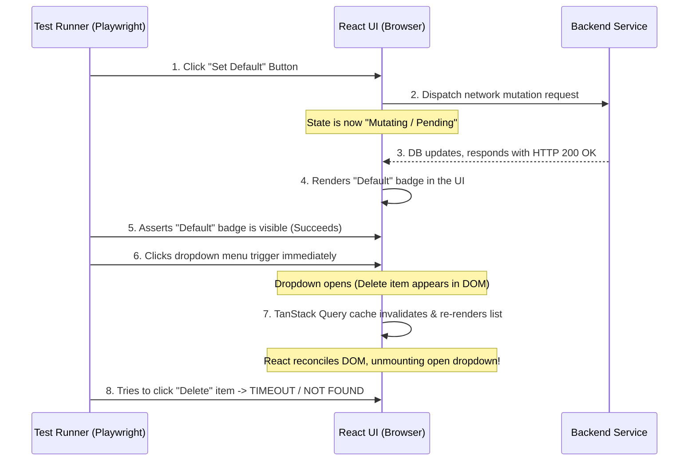

# Guide: Structurally Eliminating E2E Flakiness & State-Render Race Conditions

E2E (End-to-End) test suites frequently pass 100% of the time on local machines, only to display flaky failures or intermittent timeout errors in CI/CD pipelines (e.g., GitHub Actions, GitLab CI, Vercel Previews). 

This guide outlines the root causes, detection techniques, and production-grade engineering patterns to structurally eliminate these timing race conditions.

---

## 1. The Core Paradox: Local vs. CI Environments

To solve E2E flakiness, you must understand the hardware disparity:
* **Local Machines:** Have high CPU speeds, multiple physical cores, and zero resource contention. React state updates and database queries complete near-instantaneously, hiding asynchronous race conditions.
* **CI/CD Runners:** Run on highly constrained, shared virtual machines (often 2 vCPUs). CPU throttling and memory allocation limits are common. This delays React rendering ticks and API network roundtrips by orders of magnitude, exposing micro-timing vulnerabilities.

---

## 2. The Classic "React State Re-Render" Race Condition

This is the most common form of UI flakiness. It occurs when **Playwright/Cypress is faster than the browser's React state machine.**

### Chronology of a Failure


### Why it manifests as "Flaky"
Because of system CPU latency variations, sometimes Step 7 completes *before* Step 6, and sometimes it completes *after* Step 6. If it completes during/after Step 6, the re-render tears down the newly opened dropdown, failing the test. Playwright retries the test, the timing window shifts, and it passes on the retry (marking it **flaky** instead of **red**).

---

## 3. Structural Solution Patterns

Do not use raw time delays (e.g., `page.waitForTimeout(1000)` or `setTimeout`). These are anti-patterns that bloat E2E run times and eventually fail when CI becomes even slower. Instead, use **reactive synchronization gates**.

### Pattern A: Network In-Flight Settlement Gates (Recommended)
Force the test runner to wait for the background network mutation and subsequent data refreshes to complete **before** executing subsequent UI interactions.

```typescript
// 1. Set up the network hook FIRST
const refreshPromise = page.waitForResponse(async (resp) => {
  return resp.url().includes('/api/v1/addresses') && resp.request().method() === 'GET';
}, { timeout: 15000 });

// 2. Perform the action
await defaultItem.click();

// 3. Wait for the network call to fully settle
await refreshPromise;

// 4. Proceed to click interactive menus safely
await menuBtn.click();
```

### Pattern B: UI Landmark Settlement Gates
If you cannot hook the network request, assert a visual "landmark" that proves the parent container has finished updating and is stable.

* **Wait for a skeleton/loading state to disappear:**
  ```typescript
  await expect(page.locator('.loading-skeleton')).not.toBeVisible({ timeout: 10000 });
  ```
* **Wait for transition attributes to finish:**
  Check if a container has settled into its final class or state (e.g. `aria-busy="false"` or `data-state="idle"`).

### Pattern C: Decoupling Dropdowns from Re-renders
For maximum structural safety in your component design:
* Use **inline actions** (like direct icons/buttons for delete/edit) instead of hiding high-frequency actions inside nested hover or popup menus (`DropdownMenu`), especially for lists that undergo reactive query updates.

---

## 4. Case Study: GoRola Address CRUD Flakiness

### The Vulnerable Test Code (`checkout.spec.ts`)
```typescript
// Triggering the change
await defaultItem.click();
await expect(addressCard.locator('[data-testid="default-badge"]')).toBeVisible();

// DELETE PHASE (RACY)
await menuBtn.click(); // Opens dropdown
const deleteItem = page.getByRole('menuitem', { name: /Delete/i });
await expect(deleteItem).toBeVisible({ timeout: 10000 }); // <-- FAILS HERE (Menu unmounted by default-mutation's re-render)
await deleteItem.click();
```

### The Stabilized Test Code
To fix this, we ensure that we wait for the update mutation's API fetch and the subsequent cache refresh to finish completely before opening the dropdown.

```typescript
// 1. Hook the GET address network response representing the post-update refresh
const refreshPromise = page.waitForResponse(async (resp) => {
  if (resp.url().includes('/api/v1/addresses') && resp.request().method() === 'GET') {
    const json = await resp.json().catch(() => ({}));
    // Check that our modified address card is returned with its default state true
    return json.data?.addresses?.some((a: any) => a.label === uniqueLabel && a.isDefault === true);
  }
  return false;
}, { timeout: 15000 });

// 2. Click "Set as Default"
await defaultItem.click();

// 3. Wait for database and UI state synchronization to settle 100%
await refreshPromise;
await expect(addressCard.locator('[data-testid="default-badge"]')).toBeVisible();

// 4. It is now completely safe to click menus and trigger delete
await menuBtn.click();
const deleteItem = page.getByRole('menuitem', { name: /Delete/i });
await expect(deleteItem).toBeVisible({ timeout: 10000 });
await deleteItem.click();
```

---

## 5. The Double-Click Event Race: GSAP Animations vs. Radix UI Focus Lifecycle

In modern premium websites, animations (like GSAP timelines) and interactive overlays (like Radix UI Dropdowns, Modals, and Drawers) are ubiquitous. In E2E testing, these present two highly deceptive timing races that can easily fail your pipeline.

### A. The GSAP / CSS Animation Trap
* **The Concept:** GSAP and CSS animations animate elements smoothly over time. In E2E tests, clicking an element while it is sliding or fading in/out can cause the click coordinates to miss or target a half-rendered state.
* **The Native Solution:** We often bypass this by globally disabling GSAP or setting transition durations to `0` in E2E environments (e.g., `gsap.globalTimeline.clear()`, or CSS `* { transition: none !important; animation: none !important; }`).
* **The Gotcha:** While disabling the visual animation makes the element instantly appear/disappear, **it does NOT disable the underlying Javascript rendering ticks or component lifecycle delays**.

### B. The Radix UI Focus & Pointer-Event Overlay Race (Why clicks get lost)
Even with animations completely disabled, UI primitives (like Radix UI / Shadcn UI) have complex internal event-handling routines that run asynchronously:
1. **Focus Restoration (`FocusScope`):** When a dropdown menu, modal, or popover closes, Radix schedules a microtask to asynchronously return keyboard focus back to the button that triggered it (`menuBtn`).
2. **Pointer-Event Interceptor (`DismissableLayer`):** To prevent mouse clicks from firing on the background page while a dropdown is open, Radix mounts a full-screen transparent overlay with `pointer-events: auto`.
3. **The Race Condition:**
   - **Step 1:** You click a menu item (like "Set as Default").
   - **Step 2:** The dropdown closes. The portal is unmounted.
   - **Step 3:** Radix begins tearing down the `DismissableLayer` and restoring focus to `menuBtn` inside an asynchronous tick.
   - **Step 4:** Playwright immediately fires a click on `menuBtn` to reopen the menu for another action (like "Delete").
   - **Step 5:** Because the tear-down of the overlay and focus restoration takes a frame, the click event is **intercepted and swallowed** by the dying pointer-event overlay. The menu never opens, and the next expectation fails.

### C. The Bulletproof Pattern for Future Projects
Whenever you are performing consecutive interactions with the **same trigger element** (e.g. opening a menu, clicking an item, and then immediately opening the menu again to click another item):

1. **Assert complete unmounting of the overlay first:**
   ```typescript
   // Wait for the popup menu to be completely removed from the DOM/Viewport
   await expect(page.getByRole('menu')).not.toBeVisible();
   ```
2. **Add a brief event-binding cooldown buffer:**
   ```typescript
   // A tiny 300ms-500ms timeout guarantees the browser thread has finished Radix focus restoration
   await page.waitForTimeout(500);
   ```
3. **Confirm the overlay is open before querying its child items:**
   ```typescript
   await menuBtn.click();
   await expect(page.getByRole('menu')).toBeVisible(); // Confirms Radix has painted the new portal
   ```

---

## 6. Case Study: Timezone-Boundary Validation Fallbacks
### The Problem
When E2E tests select "tomorrow" (`+1 day`) for booking slots, timezone discrepancies between the local system running the browser and the backend server (especially near the midnight boundary) can cause the server to calculate the selection as "today". If the backend enforces a `1-day` minimum lead-time restriction, this results in an unexpected validation failure (`INVALID_BOOKING_DATE`).

### The Solution
Shift all E2E date selections to **at least 2 days in the future** (`+2 days`). This is completely compliant with lead-days constraints and mathematically immune to midnight-boundary or timezone-offset discrepancies between the browser context and backend environments.

---

## 7. Case Study: WebSocket Query Invalidation Settlement
### The Problem
When a real-time event (like a booking status change) is received via Socket.IO, updating the local React state immediately (e.g. `status = "CANCELLED"`) is highly responsive. However, doing so *without* updating secondary backend properties (like the `rejectionReason`) leaves the client in a partially sync-locked state, causing E2E tests to fail when verifying that the rejection reason is displayed alongside the status.

### The Solution
When a status changed socket event is received, perform a two-pronged sync action:
1. **Optimistic UI Update:** Immediately update the local query's status field to prevent visual lag or state flickering.
2. **Cache Invalidation:** Call `queryClient.invalidateQueries` for that specific query. This forces a clean, concurrent API refetch in the background, pulling down the fully updated database object (including `rejectionReason`) deterministically.

---

## 8. Case Study: Sonner Toast Pointer Interception & Hover-to-Pause Deadlock
### The Problem
During mobile viewport testing (such as `iphone-se`), viewports are compact, and interactive elements (like a `"Confirm Booking"` submit button) frequently share coordinates with or sit directly underneath the viewport area designated for toast notifications (e.g. the `"Address added successfully"` toast). 
When Playwright initiates a click event on the target button while a toast is active:
1. **Pointer Overlap:** The click or mouse movement places the virtual mouse pointer over the toast notification.
2. **Sonner Hover-to-Pause Feature:** Toast libraries like Sonner automatically pause their auto-dismiss timers when a hover state is detected to ensure users have enough time to read the toast.
3. **Deadlock State:** Playwright's mouse hover pauses the toast's dismissal timer indefinitely. Because the pointer remains on the toast, it never fades away, permanently blocking subsequent click events or element inspection on any buttons positioned beneath it. The test hangs and eventually times out after 2 minutes.

### The Solution
While `{ force: true }` clicks can bypass simple layout overlaps, they do not resolve the Sonner hover-to-pause deadlock if the toast continues to render and intercept pointer events. The most bulletproof approach is to programmatically hide or remove the toaster element from the DOM prior to performing critical clicks:

```typescript
// Programmatically hide the Sonner toaster container using style injection
await page.evaluate(() => {
  const toaster = document.querySelector('[data-sonner-toaster]') as HTMLElement;
  if (toaster) {
    toaster.style.display = 'none';
  }
});
```
This instantly clears the viewport of any active or queued toasts, unblocking the target click coordinates and eliminating the flakiness entirely.

---

## 9. Case Study: Responsive Navigation Scoping & Viewport-Agnostic Locators

### The Problem
Responsive web designs dynamically hide and show entire structural layout containers (like desktop sidebars or mobile bottom-nav bars) using media query classes (e.g. `hidden md:flex` and `flex md:hidden`).
If an E2E test scripts navigation transitions by scoping elements inside a container that gets hidden on specific viewports:
```typescript
// Fails on mobile viewports because the 'aside' sidebar is hidden (display: none)
await page.locator('aside').getByRole('link', { name: 'Services' }).click();
```
Playwright will fail the test with a `TimeoutError` stating that the locator resolves to an invisible element.

### The Solution
Instead of hard-scoping links to viewport-specific layouts, write viewport-agnostic locators. Target the element globally by its role and name, and filter for visual visibility:
```typescript
// Matches the visible link regardless of whether it's rendered inside the aside sidebar or mobile bottom-nav
await page.getByRole("link", { name: "Services" }).filter({ visible: true }).click();
```
This guarantees that tests remain layout-agnostic and execute flawlessly across all desktop, tablet, and mobile viewports.

---

## 10. The `{ force: true }` Anti-Pattern: Why It Exists, Why It Silently Fails, and the Correct Replacement

### Why `force: true` Was Introduced

Playwright's `locator.click()` runs a full pre-click actionability check sequence before dispatching the event:
1. Element is attached to the DOM
2. Element is visible (not `display:none` or `opacity:0`)
3. Element is stable (not animating or layout-shifting)
4. Element is enabled (not `disabled` attribute)
5. Element **is not obscured** — the point at the center of the element is not covered by another element

Step 5 is the one that bites most in rich UIs. Mobile viewports (e.g. iPhone SE at 375px) frequently have Sonner toast notifications, loading overlays, or animation artifacts that sit briefly at the top of the z-stack, covering button hit areas. When Playwright detects the element is obscured, it throws `locator.click: Element is not visible` or just waits for the obstruction to clear, eventually timing out.

The instinctive solution is to add `{ force: true }`, which **skips all actionability checks** and fires the mouse event immediately:

```typescript
// "Fix" — skips checks so the test doesn't timeout
await page.getByRole('button', { name: 'Confirm Restock' }).click({ force: true });
```

This pattern spread across the codebase as a way to "get past" the timeout on narrow viewports, especially inside toast-heavy mutation flows.

---

### Why It Fails Silently (and Is Worse Than the Timeout)

`{ force: true }` bypasses Playwright's checks, but it **does NOT bypass the browser's native event dispatch**. The way `locator.click({ force: true })` works under the hood is:

1. It moves the virtual mouse pointer to the center coordinate of the target element.
2. It dispatches `mousedown` / `mouseup` / `click` native events to **whatever DOM element is at that coordinate**.

If a Sonner toast (with `z-index: 9999`) is visually on top of the button, the browser's event dispatch sends the click **to the toast's DOM node**, not the button. The button's `onClick` handler never fires. The mutation never runs.

The test then proceeds past the click line and may: 
- Wait for the modal to close (`not.toBeVisible`), which times out → **visible failure**, OR
- See the modal close for an *unrelated* reason (e.g. backdrop interaction, prior state) and proceed silently → **ghost pass / downstream failure** at a later assertion that depends on the mutation having run (e.g. a missing `RESTOCK` row in audit history)

The ghost-pass scenario is the most dangerous because the test appears to "work" for the wrong reason, and the actual bug surfaces 10 lines later with a cryptic error that has nothing to do with the real cause.

---

### Real-World Example from GoRola

In `store-owner-journey.spec.ts` (E2E-023: Inventory Restock & Audit History Logging), the test:

1. Opens the restock modal and clicks `Confirm Restock` with `force: true`
2. The `onSuccess` handler on the restock mutation fires `toast.success("Inventory restocked successfully")`
3. The restock modal closes (mutually: `setRestockVariant(null)` is called in `onSuccess`)
4. The test immediately opens the adjust modal and clicks `Confirm Adjustment` with `force: true`

On a fresh, idle system (`test:e2e` standalone), the Sonner toast dismissed quickly enough that the adjust click landed on the button. On a loaded system (`ci:quality`, which runs build + unit tests first), the toast animated for a fraction longer, widening the window — the adjust click landed on the toast. The adjust mutation never fired. The `#adjust-qty-input` became `not.toBeVisible` via a different path (backdrop). The test proceeded. Then the stock history page showed no `ADJUSTMENT` row → test failed at line 356 with a confusing "element not found" error.

The same pattern caused a second failure mode: `Confirm Restock` itself being intercepted in a prior scenario, resulting in no `RESTOCK` row either.

---

### The Correct Replacement: `dispatchEvent` + Network Settlement Gates

**Rule: never rely on `force: true` when clicking a button that triggers a mutation.** Use two patterns together:

#### Pattern 1: `dispatchEvent('click')` to bypass browser hit-testing

Unlike `locator.click()`, `locator.dispatchEvent('click')` fires the event **directly on the element's registered JavaScript event listeners**, completely bypassing the browser's coordinate-based hit-testing. The event does not "land" on a z-index winner — it goes straight to the target element's handlers.

```typescript
// Before (broken on narrow viewports with overlapping toasts):
await page.getByRole('button', { name: 'Confirm Restock' }).click({ force: true });

// After (fires directly on the button's onClick handler regardless of what's on top):
await page.getByRole('button', { name: 'Confirm Restock' }).dispatchEvent('click');
```

> [!IMPORTANT]
> **Critical limitation:** `dispatchEvent` works correctly for pure React `onClick` mutation handlers (e.g. a `<button onClick={() => mutate(...)}`). It does **NOT** reliably work for buttons that call `navigate()` (React Router's programmatic navigation). The reason: `navigate()` is invoked inside the onClick handler, but when the event is non-trusted (synthetic), React Router's navigation guard may not execute the history push correctly, and `page.waitForURL()` will time out. For navigation buttons, use `click({ force: true })` instead after ensuring any blocking toast is cleared.
> 
> `dispatchEvent` also does NOT scroll to the element, does NOT check enabled state, and does NOT wait for stability. Ensure you have already confirmed the button is present and enabled before dispatching.

#### Pattern 2: Pre-hook a `waitForResponse` as a mutation proof gate

"Did the click work?" is best answered by watching the network, not the UI. Set up a response listener *before* the click, then await it after. If the mutation never fires (click was intercepted), this awaiter hangs and fails at *the right place* with a clear timeout message — not silently 10 assertions later.

```typescript
// Hook the PUT /stock response BEFORE dispatching the click
const mutationSettled = page.waitForResponse(
  (resp) => resp.url().includes('/stock') && resp.request().method() === 'PUT',
  { timeout: 15000 }
);

await page.getByRole('button', { name: 'Confirm Restock' }).dispatchEvent('click');

// Explicit proof that the mutation reached the server
await mutationSettled;

// Only now check the UI side-effects
await expect(page.locator('#restock-qty-input')).not.toBeVisible({ timeout: 30000 });
```

#### Pattern 3: Toast-dismissal gate between sequential mutations

When two mutations fire in sequence (restock → adjust), the first mutation's `onSuccess` fires a toast. That toast can block the second mutation's button. Gate on toast dismissal between them:

```typescript
// After restock modal closes:
await expect(page.locator('[data-sonner-toast]')).not.toBeVisible({ timeout: 10000 });
// Now safe to open the adjust modal — no toast in the way
await page.locator('[data-testid="adjust-button-0"]').click({ force: true });
```

#### Pattern 4: Upfront toast gate + `force: true` + `waitForURL` for navigation buttons

If a `<button onClick={() => navigate(...)}>` is being intercepted by a toast, `dispatchEvent` will **not** fix it — React Router's programmatic navigation does not trigger reliably from non-trusted synthetic events. The correct fix is:

1. Clear any lingering toast **at the start of the test** (not just before the click) with `.catch(() => {})` so the gate never blocks if no toast is present.
2. Use `click({ force: true })` on the navigation button (safe because the toast is already gone).
3. Gate on `waitForURL` to confirm navigation actually happened before asserting page content.

```typescript
// Step 1: At test start, after navigating to a new page, clear any leftover toasts
// from prior serial tests. Sonner toasts persist across React Router navigation.
await expect(page.locator('[data-sonner-toast]')).not.toBeVisible({ timeout: 8000 }).catch(() => {});

// ... navigate to products page, search, find the edit button ...

// Step 2: force:true is safe — toast was already cleared above
await page.locator('[data-testid="edit-product-prod_rice_1"]').click({ force: true });
// Step 3: confirm navigation happened (proves the click landed on the button, not a toast)
await expect(page.locator('[data-testid="restock-button-0"]')).toBeVisible({ timeout: 15000 });
```

> [!WARNING]
> Do NOT use `dispatchEvent('click')` on navigation buttons and then await `waitForURL()`. This was tested and confirmed to fail — `waitForURL` times out because React Router's `navigate()` is not invoked from a non-trusted event in all environments. The timeout is identical to whatever `waitForURL` timeout you set, making the failure look like a slow page load rather than a click issue.

This confirms navigation actually occurred before proceeding.

---

### When `force: true` IS Still Appropriate

`{ force: true }` remains valid for non-mutation interactions where the click target has no z-index competitor and the only reason for the actionability failure is a known Playwright false-positive:

- Clicking a `role="switch"` with `aria-checked` where Playwright misidentifies the inner thumb as the hit target
- Clicking inside a Radix UI `Dialog` or `Popover` where the portal overlay covers child elements
- Clicking deeply nested elements where `scrollIntoViewIfNeeded` doesn't help due to scroll container scoping

In these cases, `force: true` is acceptable **only if** the button is not inside a toast/overlay shadow and there is no mutation that needs to be verified via network gate.

---

## 11. Summary Cheat Sheet for Developers

| Symptom | Probable Cause | Corrective Action |
| :--- | :--- | :--- |
| `Locator not found / Timeout` on modal, dropdown, or submenu | Component re-render unmounted the UI overlay mid-flight. | Wait for the cache update/query refresh to settle (`waitForResponse`) before opening the menu. |
| Test fails on CI but is 100% green locally | CI runner CPU throttle lag slows React/DOM rendering cycles. | Avoid arbitrary delays; use dynamic assertion gates (`toBeVisible`, `toHaveCount`). |
| Mutation-dependent assertion fails (e.g. "RESTOCK row not found") even though the modal appeared to close | `force: true` click landed on a toast overlay; mutation never fired; modal closed via a ghost interaction | Replace `click({ force: true })` with `dispatchEvent('click')` and add a `waitForResponse` gate to prove the API was called. |
| Click event doesn't seem to fire on a non-mutation UI element | A layout shift or animation is covering the element | `{ force: true }` is acceptable here; use `scrollIntoViewIfNeeded()` first if possible. |
| `INVALID_BOOKING_DATE` failure on midnight/timezone boundary | Server and browser date mismatch on `+1 day` boundaries. | Shift the E2E date selection to **at least +2 days** in the future to ensure safety. |
| Stale details (like rejection reason) missing after WebSocket status update | The socket event only pushed the basic status string without secondary DB fields. | Concurrently update local status query data optimistically, and trigger `queryClient.invalidateQueries` to fetch the complete updated record. |
| `locator.click: Timeout` on multi-viewport navigation links | The first matched element is hidden in the current viewport (e.g. desktop sidebar is hidden on mobile). | Use `.filter({ visible: true }).first()` to dynamically target the active visible element in the current viewport. |
| Navigation button (`onClick={() => navigate(...)}`) click does nothing; next page element times out | A toast from a prior serial test persisted across React Router navigation and intercepted the button click; `navigate()` never called | Add a toast-dismissal gate **at the start of the test** (`.catch(() => {})` so it doesn't block if no toast): `await expect(page.locator('[data-sonner-toast]')).not.toBeVisible({ timeout: 8000 }).catch(() => {})`, then use `click({ force: true })`. Do NOT use `dispatchEvent` — React Router navigation does not trigger from non-trusted events. |
| Click event blocked/deadlocked by toast notifications | Sonner's "hover to pause" feature deadlocks the auto-dismiss timer when Playwright's mouse pointer hovers over a toast. | Wait for `[data-sonner-toast]` to be `not.toBeVisible` before the next click, OR programmatically hide: `await page.evaluate(() => { (document.querySelector('[data-sonner-toaster]') as HTMLElement).style.display = 'none'; })`. |
