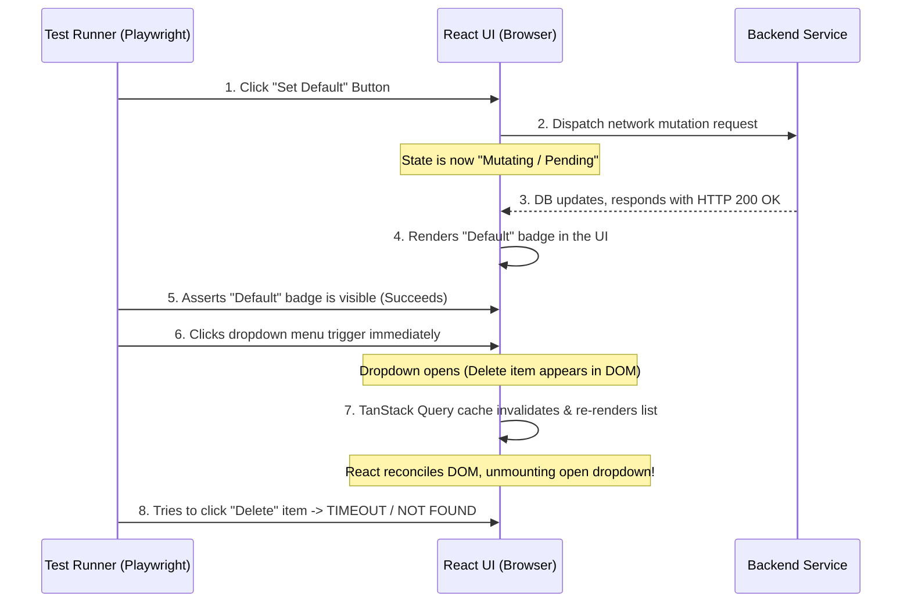

# Guide: Structurally Eliminating E2E Flakiness & State-Render Race Conditions

E2E (End-to-End) test suites frequently pass 100% of the time on local machines, only to display flaky failures or intermittent timeout errors in CI/CD pipelines (e.g., GitHub Actions, GitLab CI, Vercel Previews). 

This guide outlines the root causes, detection techniques, and production-grade engineering patterns to structurally eliminate these timing race conditions.

---

## 1. The Core Paradox: Local vs. CI Environments

To solve E2E flakiness, you must understand the hardware disparity:
* **Local Machines:** Have high CPU speeds, multiple physical cores, and zero resource contention. React state updates and database queries complete near-instantaneously, hiding asynchronous race conditions.
* **CI/CD Runners:** Run on highly constrained, shared virtual machines (often 2 vCPUs). CPU throttling and memory allocation limits are common. This delays React rendering ticks and API network roundtrips by orders of magnitude, exposing micro-timing vulnerabilities.

---

## 2. The Classic "React State Re-Render" Race Condition

This is the most common form of UI flakiness. It occurs when **Playwright/Cypress is faster than the browser's React state machine.**

### Chronology of a Failure


### Why it manifests as "Flaky"
Because of system CPU latency variations, sometimes Step 7 completes *before* Step 6, and sometimes it completes *after* Step 6. If it completes during/after Step 6, the re-render tears down the newly opened dropdown, failing the test. Playwright retries the test, the timing window shifts, and it passes on the retry (marking it **flaky** instead of **red**).

---

## 3. Structural Solution Patterns

Do not use raw time delays (e.g., `page.waitForTimeout(1000)` or `setTimeout`). These are anti-patterns that bloat E2E run times and eventually fail when CI becomes even slower. Instead, use **reactive synchronization gates**.

### Pattern A: Network In-Flight Settlement Gates (Recommended)
Force the test runner to wait for the background network mutation and subsequent data refreshes to complete **before** executing subsequent UI interactions.

```typescript
// 1. Set up the network hook FIRST
const refreshPromise = page.waitForResponse(async (resp) => {
  return resp.url().includes('/api/v1/addresses') && resp.request().method() === 'GET';
}, { timeout: 15000 });

// 2. Perform the action
await defaultItem.click();

// 3. Wait for the network call to fully settle
await refreshPromise;

// 4. Proceed to click interactive menus safely
await menuBtn.click();
```

### Pattern B: UI Landmark Settlement Gates
If you cannot hook the network request, assert a visual "landmark" that proves the parent container has finished updating and is stable.

* **Wait for a skeleton/loading state to disappear:**
  ```typescript
  await expect(page.locator('.loading-skeleton')).not.toBeVisible({ timeout: 10000 });
  ```
* **Wait for transition attributes to finish:**
  Check if a container has settled into its final class or state (e.g. `aria-busy="false"` or `data-state="idle"`).

### Pattern C: Decoupling Dropdowns from Re-renders
For maximum structural safety in your component design:
* Use **inline actions** (like direct icons/buttons for delete/edit) instead of hiding high-frequency actions inside nested hover or popup menus (`DropdownMenu`), especially for lists that undergo reactive query updates.

---

## 4. Case Study: GoRola Address CRUD Flakiness

### The Vulnerable Test Code (`checkout.spec.ts`)
```typescript
// Triggering the change
await defaultItem.click();
await expect(addressCard.locator('[data-testid="default-badge"]')).toBeVisible();

// DELETE PHASE (RACY)
await menuBtn.click(); // Opens dropdown
const deleteItem = page.getByRole('menuitem', { name: /Delete/i });
await expect(deleteItem).toBeVisible({ timeout: 10000 }); // <-- FAILS HERE (Menu unmounted by default-mutation's re-render)
await deleteItem.click();
```

### The Stabilized Test Code
To fix this, we ensure that we wait for the update mutation's API fetch and the subsequent cache refresh to finish completely before opening the dropdown.

```typescript
// 1. Hook the GET address network response representing the post-update refresh
const refreshPromise = page.waitForResponse(async (resp) => {
  if (resp.url().includes('/api/v1/addresses') && resp.request().method() === 'GET') {
    const json = await resp.json().catch(() => ({}));
    // Check that our modified address card is returned with its default state true
    return json.data?.addresses?.some((a: any) => a.label === uniqueLabel && a.isDefault === true);
  }
  return false;
}, { timeout: 15000 });

// 2. Click "Set as Default"
await defaultItem.click();

// 3. Wait for database and UI state synchronization to settle 100%
await refreshPromise;
await expect(addressCard.locator('[data-testid="default-badge"]')).toBeVisible();

// 4. It is now completely safe to click menus and trigger delete
await menuBtn.click();
const deleteItem = page.getByRole('menuitem', { name: /Delete/i });
await expect(deleteItem).toBeVisible({ timeout: 10000 });
await deleteItem.click();
```

---

## 5. Summary Cheat Sheet for Developers

| Symptom | Probable Cause | Corrective Action |
| :--- | :--- | :--- |
| `Locator not found / Timeout` on modal, dropdown, or submenu | Component re-render unmounted the UI overlay mid-flight. | Wait for the cache update/query refresh to settle (`waitForResponse`) before opening the menu. |
| Test fails on CI but is 100% green locally | CI runner CPU throttle lag slows React/DOM rendering cycles. | Avoid arbitrary delays; use dynamic assertion gates (`toBeVisible`, `toHaveCount`). |
| Click event doesn't seem to fire | A layout shift or overlapping toast message intercepted the click. | Use `{ force: true }` or scroll the element into view first (`scrollIntoViewIfNeeded()`). |
