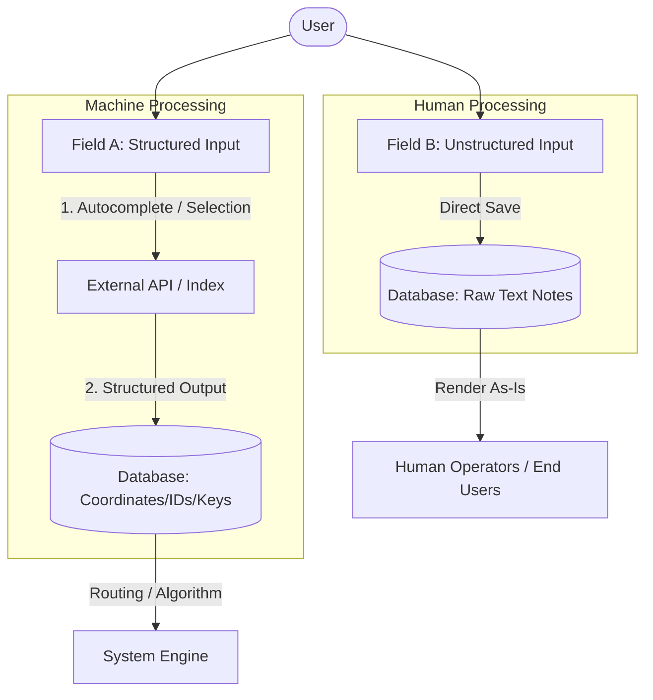

# The Two-Field Design Pattern: Separating Machine and Human Inputs

When designing user interfaces that capture complex data (such as locations, products, user bios, or scheduling rules), developers often fall into the trap of using a single text field to serve two different consumers: **an API or machine algorithm** and **a human reader**.

This guide defines the **Two-Field Design Pattern**, outlines when to apply it, provides a generalized rubric for future projects, and demonstrates its application in our current project's location picker.

---

## 1. The Core Problem: The Single-Field Anti-Pattern

When a single input field tries to satisfy both machine readability (for querying, geocoding, indexing, or parsing) and human readability (for context, nuances, and custom instructions), the system fails in one of three ways:

1. **API Failures / Noise:** The user types unstructured instructions (e.g., *"Opposite the bank, ring bell twice"*). The API (e.g., a Geocoding service) fails to parse it and returns zero results.
2. **Loss of Human Context:** To prevent API failures, the UI forces strict validation on the single field, preventing the user from entering helpful notes (e.g., *"leave package at green gate"*).
3. **Data Corruption:** The user appends human notes to a valid structured selection (e.g., *"123 Main St (Basement Apt)"*), which breaks subsequent API integrations or database searches that expect clean inputs.

---

## 2. The Pattern Defined: Separating the Concerns

The Two-Field Design Pattern resolves this by splitting the input into two distinct fields with clear, separate responsibilities:

### Field A: The Structured Field (Machine-Readable)
* **Purpose:** Feeding autocomplete APIs, matching search indexes, retrieving unique identifiers, or fetching exact coordinates.
* **UX Controls:** Search-with-autocomplete inputs, dropdown lists, sliders, date pickers, or map click interactions.
* **Data Outcome:** Produces strict data models like `latitude`/`longitude`, system IDs, ISO strings, or slugs.

### Field B: The Unstructured Field (Human-Readable)
* **Purpose:** Allowing the user to supply free-form notes, context, landmarks, or special handling instructions.
* **UX Controls:** Standard text inputs or multiline textareas. No validation against external lookups or APIs.
* **Data Outcome:** Stored as raw, unparsed text and displayed directly to the human actor who needs it.

---

## 3. General Domain Examples

| Domain / Use Case | Field A: Structured (Machine-Readable) | Field B: Unstructured (Human-Readable) |
| :--- | :--- | :--- |
| **Location & Logistics** | Address search input (resolves to geocoded coordinates). | Landmark details & delivery instructions (e.g., *"leave with receptionist"*). |
| **Scheduling & Calendars** | Recurring pattern selector (ISO datetime or RRule config). | Human schedule label (e.g., *"Occurs every major holiday except winter"*). |
| **Product Inventory** | Standard SKU, UPC, or hierarchical categories (for indexing). | Custom display title & product description. |
| **User Identity** | Unique username / URL handle (alphanumeric, slugified, unique). | Public display name / Bio (supports spaces, emojis, custom text). |
| **Asset Tagging** | Structured system tags (selected from a predefined taxonomy). | Free-form contextual notes or remarks about the asset. |

---

## 4. Concrete Example: GoRola Address Map Picker

In our ride-hailing and delivery application, this problem manifests during address selection. A user needs to pin their address and provide instructions for the Rider.

### The Anti-Pattern
Initially, a single `landmarkDescription` textarea was used. However:
* When we geocoded the text *"near hotel padmini, green door"*, the Ola Places API returned no results because it could not isolate *"hotel padmini"* from the surrounding natural text.
* If we restricted the field to strict geocoded addresses, riders could not find the exact door since many structures lack official house numbers.

### The Two-Field Solution
We separate the location acquisition into two fields in the `OlaAddressMapPicker`:

1. **Address Search Field (Field A):**
   * A search bar above the map connected to the **Ola Maps Auto-Suggest API**.
   * As the user types and selects a suggested location, the map center updates, pinning the exact `latitude` and `longitude`.
   * **Data Saved:** `{ lat: 30.3456, lng: 78.0123, formattedAddress: "Hotel Padmini, Mussoorie Road" }`

2. **Landmark / Details Textarea (Field B):**
   * A textarea below the map labeled *"Landmark or Delivery Instructions (Optional)"*.
   * The user types *"ring third-floor bell, green door on the left"*.
   * **Data Saved:** `{ landmarkDescription: "ring third-floor bell, green door on the left" }`

Both values are stored in the order schema. The backend uses the coordinates from Field A for routing and mapping, while the Rider App displays the raw text from Field B so the rider knows exactly where to stand.

---

## 5. Implementation Checklist

When implementing this pattern in future components or features:

- [ ] **Establish Separate API Payloads:** Ensure database schemas keep these fields isolated (e.g., `location_coords` and `location_details`).
- [ ] **Gate API Calls:** Never trigger expensive search or validation APIs on the keystroke of the unstructured field.
- [ ] **Visual Hierarchy:** Place the structured input first (often near visual aids like maps or calendar previews) and the unstructured input second.
- [ ] **Graceful Degraded State:** If the structured search API fails or has no results, allow the user to supply coordinates manually (e.g., click map to drop pin) while keeping the unstructured instructions field active.
- [ ] **Clear Placeholders:** Use descriptive placeholders. Field A: *"Search for address, building, or street..."* / Field B: *"Flat number, gate color, special instructions..."*

---

## 6. Common Code Smells to Watch For

* **Smell 1:** String concatenation before saving (e.g., `const fullAddress = address + ' ' + landmark`). This permanently merges machine-readable and human-readable data, making future integrations or queries impossible.
* **Smell 2:** Running NLP/RegEx parsers on a single field to "extract" the address. This is fragile, prone to internationalization errors, and breaks easily.
* **Smell 3:** Disabling the map/coordinates if the landmark text is empty. The two inputs have independent validation criteria.
